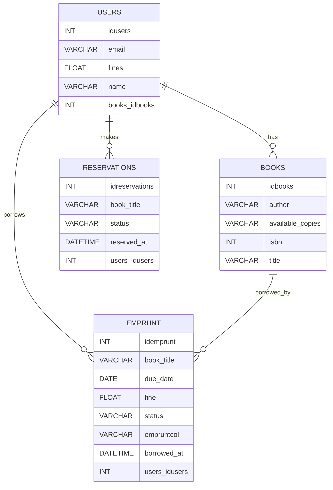

# BiblioPy

**BiblioPy** est une application web basée sur Streamlit, conçue pour permettre aux utilisateurs de se connecter, créer un compte, et emprunter des livres dans une bibliothèque. Cette application utilise Firebase Firestore comme base de données backend et se connecte via le SDK Firebase Admin, en utilisant l'interface intuitive de Streamlit pour offrir une expérience utilisateur fluide.

## Fonctionnalités

- Création de compte et connexion sécurisée via Firebase.
- Possibilité d'emprunter des livres dans une bibliothèque virtuelle.
- Intégration avec Firebase Firestore pour la gestion des données.
- Interface simple et intuitive basée sur Streamlit.
- Gestion sécurisée des identifiants Firebase via `secrets.toml` ou la gestion des secrets sur Streamlit Cloud.
- Installation et déploiement faciles sur Streamlit Cloud.

## Pré-requis

### Paquets Python

Assurez-vous que les paquets suivants sont installés :

- `streamlit`
- `firebase-admin`
- `python-dotenv` (si vous gérez les variables d'environnement localement)

### Configuration Firebase

Pour utiliser Firestore et Firebase Authentification, vous devez configurer un projet Firebase.

1. [Créer un projet Firebase](https://console.firebase.google.com/) si vous n'en avez pas encore.
2. Générer une clé privée pour le SDK Firebase Admin :
   - Accédez à la section **Comptes de service** dans la console Firebase.
   - Cliquez sur **Générer une nouvelle clé privée**, téléchargez le fichier JSON, et gardez-le en sécurité.

## Structure du projet

```bash
📦BiblioPy
 ┣ 📂.venv
 ┣ 📂.streamlit
 ┃ ┗ 📜secrets.toml         
 ┣ 📜app.py                
 ┣ 📜requirements.txt         
 ┗ 📜README.md
```

## Base de données 

